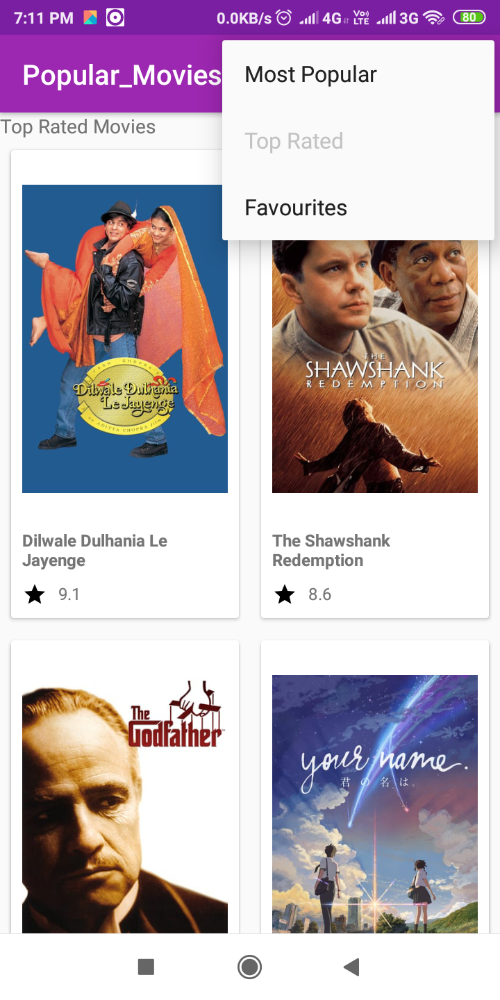

## Popular-Movies-Stage One and Two
Udacity's Android developer nano degree project
Before downloading this app, generate the api key from the [themoviesdb.org API](https://www.themoviedb.org/account/signup)and 
use that generated key in Constants.java file.

## Screenshots For Popular Movies Stage 1

## Screenshots For Popular Movies Stage 2

## Libraries Used

* [Android Support Library](https://developer.android.com/topic/libraries/support-library/)
* [Picasso](https://github.com/square/picasso/)
* [Room Persistent Library](https://developer.android.com/topic/libraries/architecture/room)
* [LiveData](https://developer.android.com/topic/libraries/architecture/livedata)
* [ViewModel](https://developer.android.com/topic/libraries/architecture/viewmodel)

Have a nice day!!!!
